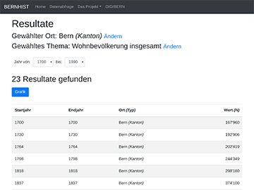
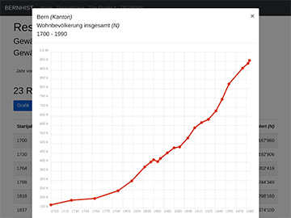
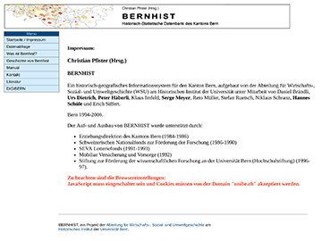

# BERNHIST

A re-programming and enhancement of BERNHIST (A historical-geographic information system for the swiss canton of Bern) to ensure further compatibility with modern technologies.

 

 

## About the original project (1994 - 2006)

BERNHIST was established by the department of economic, social and environmental History (Abteilung für Wirtschafts-, Sozial- und Umweltgeschichte, WSU) at the historical institute of the university of bern with the collaboration of Daniel Brändli, **Urs Dietrich**, **Peter Häberli**, Klaus Imfeld, **Serge Meyer**, Reto Müller, Stefan Ruetsch, Niklaus Schranz, **Hannes Schüle** und Erich Siffert.



The files of the original project can be found [here](https://github.com/ub-unibe-ch/bernhist/releases/tag/v1.0.0).

## What is new?

The re-programming was made with the PHP Framework [Symfony](<https://symfony.com>), the front-end component library [Bootstrap](<https://getbootstrap.com>) and the javascript charting library [Chartist](<https://gionkunz.github.io/chartist-js/>).
To enable automated queries an [OAI](<https://github.com/OAI/OpenAPI-Specification>) compatible API was created.

## Prerequisites

* [PHP](<https://php.net/>) 8.4 or newer (See [here](<https://symfony.com/doc/6.4/reference/requirements.html>) for more information about the needed php extensions)
* A database. The symfony framework is compatible with many database types. The project was tested with [PostgreSQL](<https://www.postgresql.org/>) server version 15
* [composer]((<https://getcomposer.org/>)) and [yarn](<https://yarnpkg.com/>)
* [Apache](<https://httpd.apache.org/>) or [NGINX](<https://www.nginx.com/>) webserver (See [here](<https://symfony.com/doc/6.4/setup/web_server_configuration.html>) for more information about the configuration).
  During development Symfony's built-in webserver can be used.

## Installation

Clone the repository:

```bash
git clone https://github.com/ub-unibe-ch/bernhist.git
```

Change to the created directory and run:

```
composer install
```

Create a local copy of the `.env` file:

```
cp .env .env.local
```

Open the created `.env.local` file and set the `DATABASE_URL` to the desired value (see [here](<https://www.doctrine-project.org/projects/doctrine-dbal/en/2.9/reference/configuration.html#connecting-using-a-url>) for examples)

If the database does not already exist execute the following command:

```
bin/console doctrine:database:create
```

Create the database schema:

```
bin/console doctrine:schema:create
```

Import the sql file `data.sql.gz` in the database:

```
gunzip -c data.sql.gz | psql -u [username] -p [database]
```

Replace [username] with the mysql user, [database] with the name of your database.

Install the frontend dependencies with:

```
yarn install
```

**Development**

Build the assets with

```
yarn encore dev
```

Run the Symfony Server with

```
bin/console server:start
```

**Production**

Build the assets with

```
yarn encore prod
```

Open the `.env.local` file and set `APP_ENV` to `prod`.

Ensure that the web root configured in the webserver points to the `public` folder.

## Contributors

### Original project

* Prof. em. Dr. Christian Pfister
* The persons named under "About the original project"
* Erziehungsdirektion des Kantons Bern (1984-1986)
* Schweizerischen Nationalfonds zur Förderung der Forschung (1986-1990)
* SEVA Lotteriefonds (1991-1993)
* Mobiliar Versicherung und Vorsorge (1992)
* Stiftung zur Förderung der wissenschaftlichen Forschung an der Universität Bern (Hochschulstiftung) (1996-97)

### Current project

* [Mathias Stocker](mailto:mathias.stocker@ub.unibe.ch), [Universität Bern](https://www.unibe.ch), [Universitätsbibliothek Bern](https://ub.unibe.ch)

## Versioning

[SemVer](http://semver.org/) is used for versioning. For the versions available, see the [tags on this repository](https://github.com/UB-BERN/bernhist/tags).

## License

This project (Version 2.0.0 and newer) is licensed under the MIT License - see the [LICENSE](./LICENSE) file for details.

